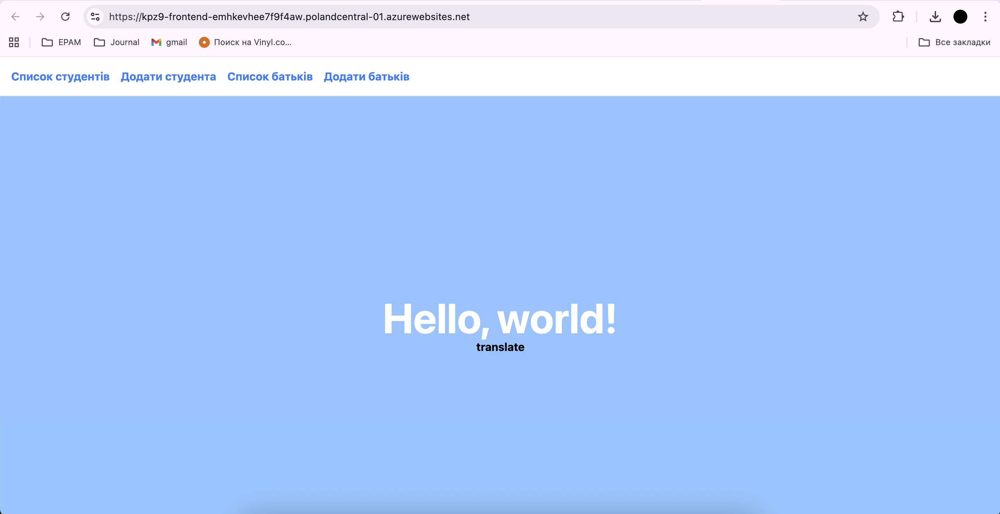

# Лабораторна робота №11

### Мета

Навчитися створювати власний GitHub Workflow для збірки Docker-образу фронтенд-застосунку та його завантаження в GitHub Container Registry, а також ознайомитися з практичними аспектами контейнеризації фронтенд-проєктів.

---

### Виконані дії

1. **Підготовка проєкту та середовища**
   - Локально перевірено збірку фронтенд-застосунку через `npm install` та `npm run build`.
   - Створено `Dockerfile`, який реалізує multi-stage збірку:
     - **Stage 1**: встановлення залежностей через `npm install` та збірка застосунку.
     - **Stage 2**: розгортання зібраного застосунку за допомогою `nginx`.
   
2. **Створення GitHub Workflow**
   - Додано файл `.github/workflows/build-and-push.yml`.
   - Workflow налаштовано з двома тригерами:
     - **ручний запуск** (`workflow_dispatch`);
     - **автоматичний запуск** при пуші у гілки `main` та `feature/*`.
   - У workflow реалізовано один job із кроками:
     1. Клонування репозиторію за допомогою `actions/checkout`.
     2. Встановлення залежностей та збірка застосунку через `npm install` та `npm run build`.
     3. Авторизація у GitHub Container Registry за допомогою `docker/login-action` із використанням автоматичного токена `GITHUB_TOKEN` та користувача `${{ github.actor }}`.
     4. Збірка та пуш Docker-образу у GHCR із тегом у форматі:
        ```
        ghcr.io/<username>/<repository>:latest
        ```
        де `<username>` та `<repository>` приведені до нижнього регістру через кастомний step у workflow.
   
3. **Тестування workflow**
   - Виконано ручний запуск workflow та перевірку автоматичного запуску при пуші.
   - Після успішного виконання з’явився Docker-образ у вкладці **Packages** на GitHub.

---

### Вивчене

- Основи GitHub Actions та принципи роботи workflow.
- Як автоматизувати збірку фронтенд-застосунку і деплой Docker-образу у GitHub Container Registry.
- Використання context змінних GitHub (`github.actor`, `github.event.repository.name`) і секретів (`GITHUB_TOKEN`) для безпечного доступу до репозиторію та GHCR.
- Різниця між локальною збіркою через `npm` і збіркою у контейнері Docker.
- Проблеми сумісності Node.js та Vite, важливість вибору правильної версії Node.js для успішної збірки.

---

### Навички, набуті під час роботи

- Створення та налаштування **Dockerfile** для фронтенд-застосунку.
- Використання multi-stage Docker build для оптимізації розміру образу.
- Налаштування GitHub Actions workflow з різними тригерами і job steps.
- Використання **Docker Buildx** для збірки та пушу образів у GHCR.
- Практичне застосування Bash для кастомних кроків workflow, наприклад для приведення username і repository до lowercase.
- Розуміння важливості версій Node.js та залежностей при побудові фронтенд-проєктів у контейнерах.

---

### Висновки

У ході виконання лабораторної роботи я детально ознайомився з процесом **автоматизації збірки і деплою фронтенд-застосунків у GitHub Actions** та практично відпрацював роботу з **Docker** і **GitHub Container Registry**. Я навчився створювати workflow із ручними та автоматичними тригерами, керувати залежностями Node.js у контейнері, правильно формувати Docker-образи і пушити їх у приватний registry.

Контейнеризація фронтенд-застосунків дозволяє забезпечити стабільність середовища, швидку збірку і розгортання, а інтеграція з GitHub Actions дає змогу автоматизувати весь процес CI/CD, що підвищує ефективність роботи команди і зменшує ймовірність помилок.

В результаті виконання роботи я:

- Отримав практичний досвід створення GitHub Workflow для CI/CD.
- Навчився збирати і деплоїти Docker-образи фронтенду.
- Ознайомився з роботою з GitHub Container Registry.
- Розвинув навички використання автоматизації для забезпечення стабільності і повторюваності збірок.

# Висновки до практично-лабораторного заняття №9  
**Тема:** Неперервна доставка  

Під час виконання практично-лабораторного заняття №9 було досягнуто наступних результатів:  

1. **Ознайомлення з принципами неперервної доставки та неперервного розгортання**  
   Було детально розглянуто концепції Continuous Delivery (CD) та Continuous Deployment (CDp). Розглянуто їхні ключові відмінності:  
   - Continuous Delivery забезпечує готовність коду до випуску, але розгортання у робочому середовищі відбувається за рішенням людини.  
   - Continuous Deployment автоматично розгортає код у робочому середовищі після проходження всіх тестів.  

2. **Вивчення переваг використання CD/CDp**  
   В процесі лабораторної роботи було підтверджено, що застосування неперервної доставки та розгортання дозволяє:  
   - Прискорити вихід продукту на ринок.  
   - Зменшити кількість помилок завдяки автоматизації процесів.  
   - Отримувати швидкий зворотний зв'язок від користувачів.  
   - Знизити стрес під час релізу нових версій програмного забезпечення.  

3. **Практичні навички роботи з Azure**  
   Виконуючи лабораторну роботу, було набуте практичне вміння:  
   - Створювати ресурсні групи та App Service у власній підписці Azure.  
   - Використовувати App Service Plan та обирати деплой контейнерів замість коду.  
   - Створювати Azure Service Principal для інтеграції GitHub Actions з Azure.  
   - Виконувати команду `az ad sp create-for-rbac` для надання прав доступу.  

4. **Інтеграція з GitHub Actions**  
   Було успішно реалізовано автоматичний деплой веб-додатку:  
   - Додано секрети в репозиторій GitHub для безпечного зберігання облікових даних Azure.  
   - Налаштовано workflow для автоматичного логіну в Azure та деплою контейнера на App Service.  
   - Перевірено успішне виконання workflow та доступність веб-сторінки фронтенду.  

5. **Висновки щодо набутих знань та навичок**  
   В результаті виконання лабораторного завдання студент набув практичного досвіду у налаштуванні неперервної доставки та розгортання. Здобуто навички роботи з хмарними сервісами Azure, інтеграції CI/CD через GitHub Actions та автоматизації процесів деплою. Ці знання є ключовими для сучасної розробки програмного забезпечення та дозволяють підвищити ефективність команди, зменшити кількість помилок і прискорити релізи продуктів.  

**Отже**, виконане лабораторне заняття сприяло поглибленню розуміння принципів непрервної доставки та розгортання, а також формуванню практичних навичок у роботі з хмарними сервісами та автоматизацією процесів розробки.

App Service Application URL: https://kpz9-frontend-emhkevhee7f9f4aw.polandcentral-01.azurewebsites.net

